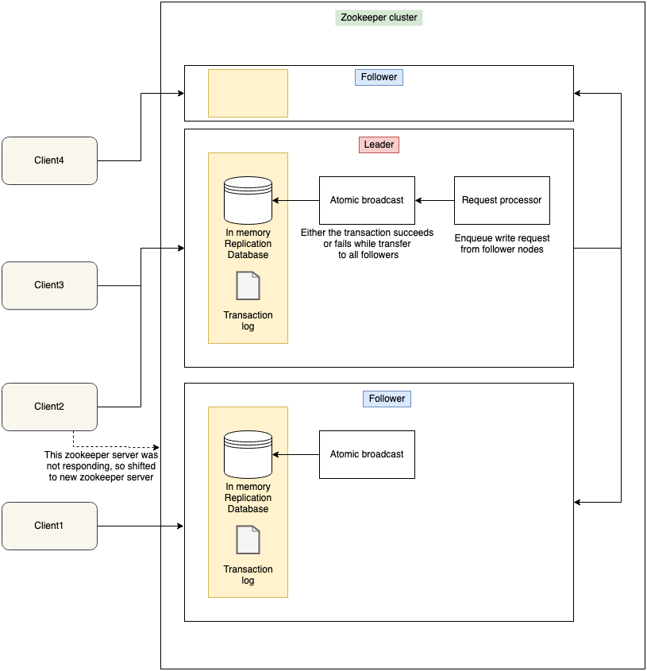
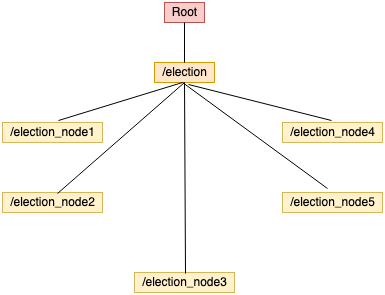
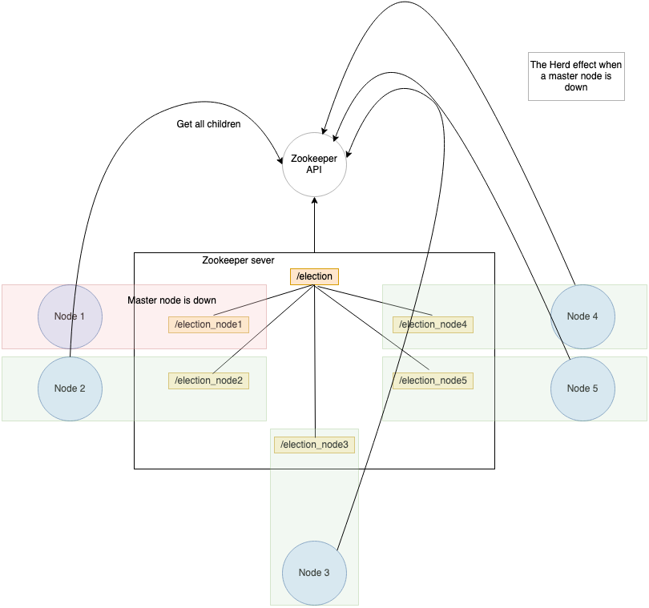
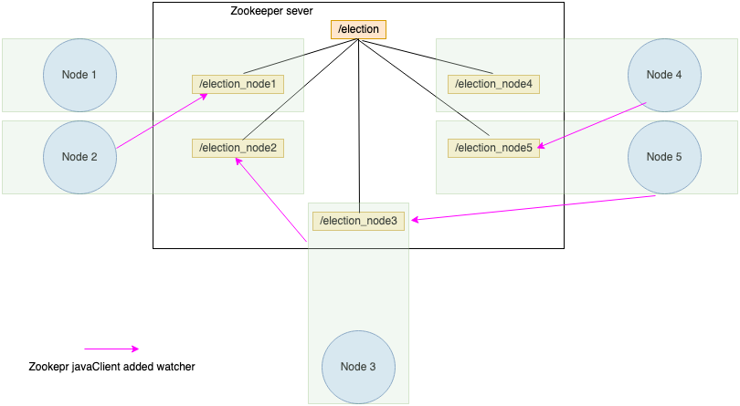
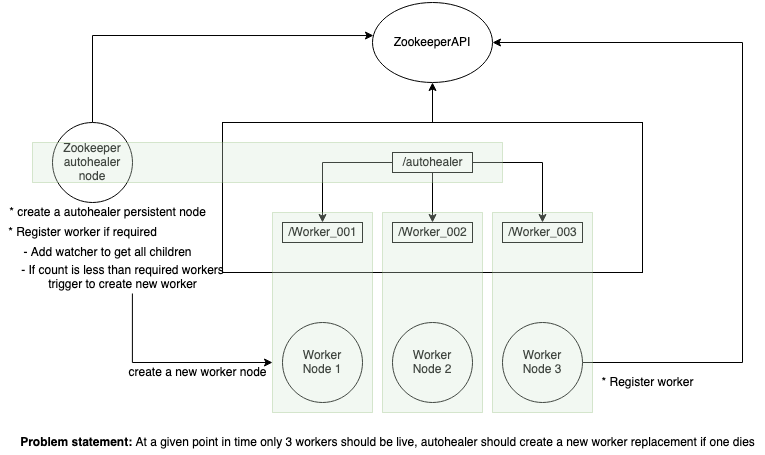
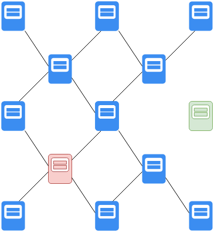
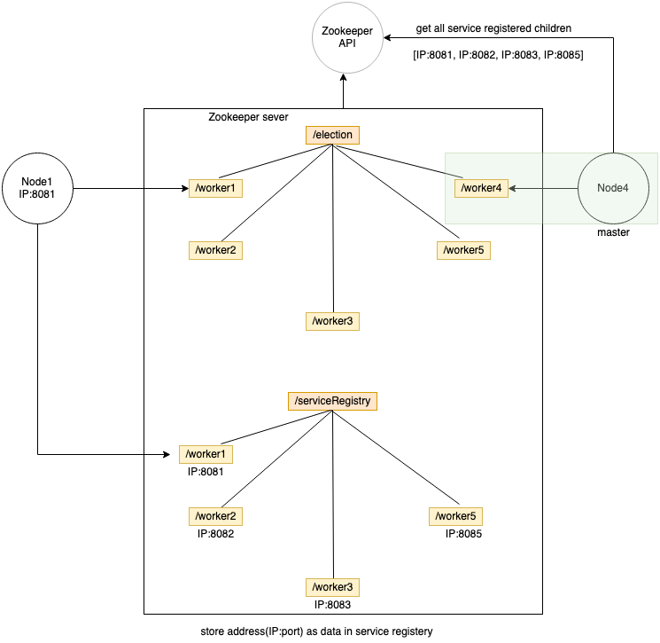

# Cluster cordination

## Terminology

* **Node**: In simple graph terms, **node is a process running in a machine**
* **cluster**: cluster of nodes running the same code or working on the same task.

### Benefits of distributed system
* **Reliability**: If also a system fails, the whole system is not down.
* **Scalability**: Horizontal scaling is possible
* **Transparency**: The cluster works and represents as a single entity.

### Challenges of distributed system
* **Race condition**: Situation when two process trying to operate on a same time on shared resource, returns ambiguity.
* **Deadlock**: when there is inter dependent of resources and waiting indefinitely.
* **Inconsistency**: Partial failure of data.
## Zookeeper
* **cluster cordination management**
* **configuration management**: keeps the latest configuration of the node by having version. Any change in the node data, the version is bumped up.
* health check and master re-election
* all the nodes contacts zookeeper service(cluster).
* zookeeper keeps the data in a tree like structure.
* locking and synchronization service.

## Zookeeper architecture
  
* Client can register itself to any of the zookeeper(ZK) cluster server.
* The ZK server has the session stored of the client. If the ZK server dies and client cannot connect, then it tries to connect to another ZK server and the session data is transfered to the new ZK server.
* Each ZK server maintains a transaction log for write request (1MB max)
* A collection of zookeeper server forms a **zookeeper ensemble**.
* When write happens, follower node forwards the request to the master node, and then master node broadcasts the write to the followers. If majority of the followers have successfully written the data(**Zookeeper Quorum**), then the write is responded as success else failed.
* Zookeeper is consistent in nature or we can say eventual consistent as it doesnt block the read requests.
* Ideally, it is recommended to have 3, 5 or 7 ZK servers as it helps to resolve quorum.

## Zookeeper hierarchical namespace

* Zookeeper stores the data of the nodes in hierarchical format.
* Each node stores the version and metadata information.

## Type of zookeeper nodes
* **peristent node:** persists the data in zookeeper. So think it like this, u have x nodes, all distinctly same. The first node calls the zookeeper to get the /workers node, but it didnt found. So it creates a new node in zookeeper server but makes it persistent so that other workers doesnt have to create again and then the worker assigns themselve to the /workers/worker_001 as emphemeral node as the worker is a single session. The node who created the /worker node can happily die. But other worker nodes can still continue to live under the tree.
* **ephemeral node:** These are session based nodes and dies as soon as the session ends.

### leader election algorithm 1 -

* In this, first, all the nodes (election_node) comes and registers themselves under the election. Each node is assigned the number based on the position which they get.
* So the first node gets election_node1 and second node gets election_node2
* Now each node will go to the parent node and assuming parent node is keeping an array of nodes which comes for election. Each node will try to get the first node in the array.
* All the other node except the first node assumes them selves as slaves
* The first node elects itself as master.
 
### leader election algorithm 2 -
  
This algorithm came into picture when the suppose the master gets down, all the nodes will at once come to the server for re-election and this is known as **herd effect**. So to minimize this, we will only listen to the node just before us.
* whenever there is a new node added, get all the child nodes, sort them, and then, get the node just before the present node.
* and then add a watcher on that node. If also this node dies then, the watcher will get triggered and then, we can again get the sortest node in the list.
* note, you will be watching the node deleted and not nodechildrenChange reason being, you are keeping a watcher on a single node.

### Auto healer
 

### Service registery and discovery
 

For cluster communication the main hurdle is to know the nodes around the cluster. To do this, one way is to provide the static configuration to all the nodes. 

But this design has limitation, suppose, one of the node goes down, or suppose, one new node is to be added. In these cases the static configuration is needed to be updated. To solve it some system uses, services where you can upload the configuration and those services will replicate the configuration on to the cluster nodes. But this require manual intervention. 

Using zookeeper service discovery, we don't need to have static configuration. Zookeeper takes care of updating the peer nodes dynamically.
  
* master node flow chart
  * After a master node is elected, it unregisters itself from the serviceRegistery by deleting the node entry
  * Then adds a watcher over the children in service registry for any update
* worker node flow chart
  * When a new node is created, it registers itself to the /election node
  * Starts watching the node just before it (leader election algo 2 )
  * Then registers its IP:port to the service registry.

### Zookeeper client threading model:
* **IO thread:**
  * network communication with the zookeeper servers.
  * handles request and response. [didnt understand]
  * has session time-out with the interaction with zookeeper main server.
* **Event thread:**
  * this thread has watcher and triggers, watcher watches the zookepeer main server.
  * Raises event if the main server is down.
  * Raises event if the client is connected with the main server.
  * This has connection time-out. Which is different from session-timeout.

* zookeeper.exists => watcher on 1 node
* zookeeper.getChildren => watcher on multiple child nodes.