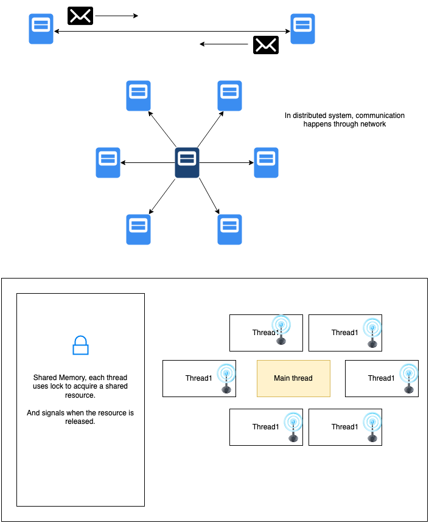

# Networking for dummies
## Basics of Network communication
### Multithreading vs Distributed System
In multithread system, each thread communicate with the shared resource. But in distributed system, there is no luxary of shared memory, so the processes need to communicate with each other using network. This tutorial we will understand how two nodes actually communicate in distributed system.

## TCP/IP Network model

The network topology is as follows:  

In network communication. The information is encapsulated in packet. And this packet is layered, each layer has different information and like onion the layers are peeled up to get to the actual information which is transfered.

The most exposed layer(datalink layer) is more close to the physical hardware. And more inner the layer(application layer) goes, it is more understoodable to the developers like us :) .

### DataLink layer:

This layer has the source and destination MAC(physical) address. When a packet reaches a router, it changes the destination MAC address. Till it reached the defined physical resource the packet is intended for. This layer encrypts packet(**encapsulation**), checks if the packet is transfered correctly, means while transit the bytes was not changed(**error detection**) and also helps in recovering(**error correction**). The network protocol this layer follows is **ethernet protocol**

### Internet layer:
  
This layer takes incharge from datalink layer. In this layer the packet is transfered across **multiple networks** and then it reaches the destination address. In this IP(virtual address) is used to map source and destination of a packet.

**Q) Does one device can have multiple IP address?**  
A) Yes, this is known as mulihoming. The above picture depicts that to remove the confusion. To learn more, can check how IP routing table is mantained in devices. In mac, type `netstat -nr` to get the mapping.

Similar to datalink layer, this layer's destination address is modified by the router till the packet reaches the destination device. The layer follows **Internet protocol**

### Transport layer:
This layer takes over the incharge from internet layer.
  

This layer extracts out the port which the packet needs to transfer to. (Note: Remember in service register in cluster coordination tutorial, I explained that only IP:port is the data needs to be stored of a worker. Now you understand, how we discover the worker process.)

This has two type of protocol:
* **User Datagram protocol(UDP)** : In this protocol transfer, the packets are unreliable, may be duplication, may be out of order. This protocol is used when speed of packet delivery is more important than packet loss. Like distributed debug logs or realtime vedio streaming or realtime gaming. This protocol is also used for broadcasting messages, decoupling sender and receiver. 
* **Transmission Control protocol (TCP)**: This protocol ensures that packets will reach destination, it is reliable and the delivery of the packets will be in order. Each process opens a seperate connection with the receiver and the connection is properly closed when the transportation of the message packets are done.
  
**Q) What are sockets, IP, Ports?**  
  * **Socket**: It is like a telephone (i.e end-to-end device for communication, a virtual communication device)
  * **IP**: It is like the telephone number (i.e address for your socket)  
  * **Port**: Is the person who receives the telephone (i.e, the process that is bind to a socket and listening to sender)

### Application layer
This layer takes over the incharge from transport layer. Transport layer transports packets of bytes, but those bytes meaning is reflected in application layer. Different type of protocol in this layer maniputes the transported bytes in different form.
* **FTP** (File Transfer protocol) : Transfering files through the web.
* **SMTP**(Simple Mail Transfer Protocol) : Sending and receiving mails.
* **DNS**(Domain Name System) : Translating host names into IP addresses.
* **HTTP**(Hypertext Transfer Protocol) : Transmitting Hypermedia documents, vedio, sound, images.

## To summarize
 