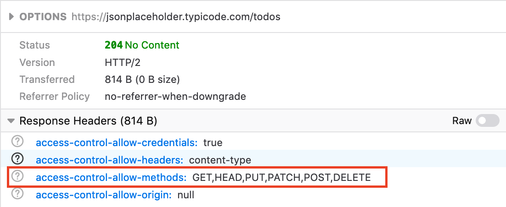
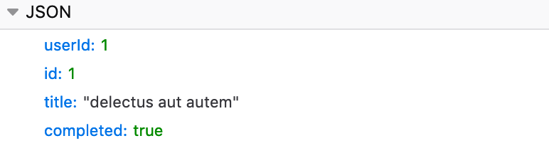

# Networking for dummies
## Basics of Network communication
### Multithreading vs Distributed System
In a multithread system, each thread communicates with the shared resource. But in a distributed system, there is no luxury of shared memory, so the processes need to communicate with each other using network. This tutorial we will understand how two nodes communicate in a distributed system.  

## TCP/IP Network model

The network topology is as follows:  

In network communication. The information is encapsulated in a packet. And this packet is layered, each layer has different information and like onion, the layers are peeled up to get to the actual information which is transferred.

The most exposed layer(data link layer) is more close to the physical hardware. And more inner the layer(application layer) goes, it is more understandable to the developers like us :).

### DataLink layer:

This layer has the source and destination MAC(physical) address. When a packet reaches a router, it changes the destination MAC address. Till it reached the defined physical resource the packet is intended for. This layer encrypts packet(**encapsulation**), checks if the packet is transferred correctly, means while transit the bytes were not changed(**error detection**) and also helps in recovering(**error correction**). The network protocol this layer follows is **ethernet protocol**

### Internet layer:
  
This layer takes in charge of the data link layer. In this layer, the packet is transferred across **multiple networks** and then it reaches the destination address. In this IP(virtual address) is used to map the source and destination of a packet.

**Q) Does one device can have multiple IP addresses?**  
A) Yes, this is known as multihoming. The above picture depicts that to remove the confusion. To learn more, can check how IP routing table is maintained in devices. In mac, type `netstat -nr` to get the mapping.

Similar to the data link layer, this layer's destination address is modified by the router until the packet reaches the destination device. The layer follows **Internet protocol**

### Transport layer:
This layer takes over the in-charge from the internet layer.
  

This layer extracts out the port which the packet needs to transfer to. (Note: Remember in-service register in cluster coordination tutorial, I explained that only IP: port is the data needs to be stored of a worker. Now you understand, how we discover the worker process.)

This has two types of protocol:
* **User Datagram Protocol(UDP)**: In this protocol transfer, the packets are unreliable, maybe duplication, may be out of order. This protocol is used when the speed of packet delivery is more important than packet loss. Like distributed debug logs or realtime video streaming or realtime gaming. This protocol is also used for broadcasting messages, decoupling sender and receiver. 
* **Transmission Control Protocol (TCP)**: This protocol ensures that packets will reach the destination, it is reliable and the delivery of the packets will be in order. Each process opens a separate connection with the receiver and the connection is properly closed when the transportation of the message packets are done.
  
**Q) What are sockets, IP, Ports?**  
  * **Socket**: It is like a telephone (i.e end-to-end device for communication, a virtual communication device)
  * **IP**: It is like the telephone number (i.e address for your socket)  
  * **Port**: Is the person who receives the telephone (i.e, the process that is bind to a socket and listening to sender)

### Application layer
This layer takes over the in-charge from the transport layer. Transport layer transports packets of bytes, but those bytes meaning is reflected in the application layer. Different type of protocol in this layer manipulates the transported bytes in a different form.
* **FTP** (File Transfer protocol): Transfering files through the web.
* **SMTP**(Simple Mail Transfer Protocol): Sending and receiving mails.
* **DNS**(Domain Name System): Translating hostnames into IP addresses.
* **HTTP**(Hypertext Transfer Protocol): Transmitting Hypermedia documents, video, sound, images.

## To summarize
Below is the representation of a single packet.

## Details on HTTP 
In the client-server model, the HTTP protocol is the standard protocol used. Following are the feature of the HTTP protocol.
* Each HTTP request expects an HTTP response with an HTTP status code.
* The HTTP protocol structure is as follows.
  * **Http method**:
    * **OPTION**: This is to check which all HTTP method are allowed.
    
    * **GET**: Get data against an id (URI).
    * **POST**: Create a new entry. For this, we dont provide the id(URI), but we provide a request body, upon which a entry is created
    
    
    * **PUT**: Update an entry. For this, we provide the id(URI), and also a request body upon which the actual body is updated.
    
    
     * **PATCH**: It is same as put but only difference is, in patch the body doesnt need to contain all the elements, it can pass only a specific key. But the response body will have all the key-value pair.
     
     
    * **DELETE**: This is to delete an entry just pass the URI
   
  * Each request has a relative **path** which points to the method in server. http://123.23.23.23:8080/`status` and path can also carry params like http://123.23.23.23:8080/`status?userId=12&type=student`
  * **Http protocol version**, it is very important to understand.
    * **HTTP/1.1**: This protocol client establishes a connection with the server if server delays to reply client establishes another separate connection to the same server. The major problem with this protocol is each new connection is expensive and increases latency. Headers are exposed and can be traced by Wireshark.
    * **HTTP/2**: This protocol client establishes a connection with the server. In this, if the client needs to create a new request, it uses the same connection. This protocol creates separate streams in a single connection. The drawback to this is, unlike HTTP/1.1, if the connection dies, all the requests get dropped, whereas in HTTP/1.1 all are separate connections. Headers are not exposed and can be traced by Wireshark.
  * **Http header**: Key-value string. Since header comes before body the user can take preliminary actions, such as memory allocations, skipping/Forwarding packets(proxying) which is L7 load-balancing. Headers are compressed and difficult to be traced by Wireshark.
  * **HTTP body**: Put anything here. Until it is parsable.
* HTTP reponse:
  * **HTTP status code**:
    * 1xx: Information Response
    * 2xx: Success
    * 3xx: Redirection
    * 4xx: Client Errors
    * 5xx: Server Errors 

